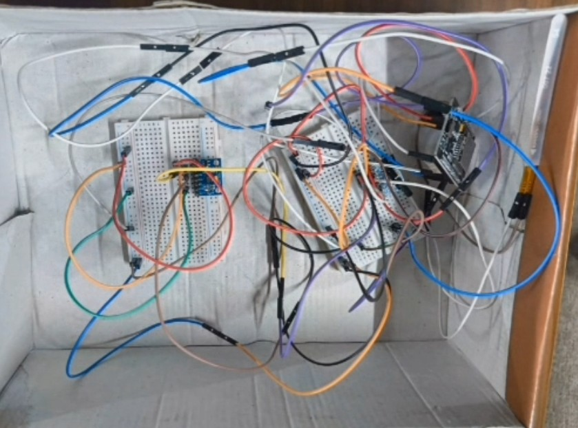

<div align="center">

# PoseGuide

### Real-Time Posture Detection & Feedback System

*Monitor, analyze, and correct your posture with wearable sensors and a 3D interactive dashboard.*

[](https://react.dev)
[](https://fastapi.tiangolo.com)
[](https://threejs.org)
[](https://espressif.com)

</div>

---

## Overview

PoseGuide is a complete posture monitoring system that uses wearable IMU sensors to track your upper-body orientation in real time. A 3D human model on a web dashboard replicates your posture, providing immediate visual feedback and intelligent posture classification.

### Key Features

- **Real-Time 3D Visualization** — Three.js-rendered human skeleton mirrors your posture
- **Posture Score (0–100)** — Continuous scoring with severity-based color coding
- **~30–50ms Latency** — Near-instant feedback from sensor to screen
- **Smart Classification** — Detects slouching, forward head posture, and lateral lean
- **Visual Alerts** — Slide-in notifications for posture deviations
- **Analytics Dashboard** — Session stats, hourly trends, posture distribution
- **Premium Dark UI** — Glassmorphism design with smooth micro-animations
- **Privacy-Preserving** — No cameras, no cloud, all data stays local

---

## Architecture

```
┌─────────────────┐        WebSocket         ┌──────────────────┐        WebSocket         ┌────────────────────┐
│   ESP32 + IMU   │ ───────────────────────▶  │  FastAPI Backend  │ ──────────────────────▶  │  React Dashboard   │
│  (Wearable HW)  │    Wi-Fi / JSON           │  (Python Server)  │   Processed Data        │  (3D + Charts)     │
└─────────────────┘                           └──────────────────┘                           └────────────────────┘
  • 2× MPU-6050 IMU                             • Posture classifier                          • Three.js 3D model
  • 1× Flex sensor                              • Score computation                           • Recharts analytics
  • Madgwick filter                             • WebSocket relay                             • Real-time gauges
```

---

## Tech Stack

| Layer | Technology | Purpose |
|-------|-----------|---------|
| **Frontend** | React 19 + TypeScript | Dashboard UI |
| **3D Engine** | Three.js + React Three Fiber | Posture visualization |
| **Charts** | Recharts | Time-series & analytics |
| **Backend** | FastAPI + Python | WebSocket server & classification |
| **Hardware** | ESP32 + MPU-6050 + Flex | Sensor data acquisition |
| **Sensor Fusion** | Madgwick Filter | Stable orientation estimation |

---

## Quick Start

See **[instructions.md](instructions.md)** for detailed setup commands.

```bash
# 1. Backend
cd Backend && python -m venv venv && .\venv\Scripts\activate && pip install -r requirements.txt && python main.py

# 2. Frontend (new terminal)
cd frontend && npm install && npm start

# 3. Hardware – Upload posture_sensor.ino via Arduino IDE
```

---

## Sensor Placement

```
        ┌─── Head ───┐
        └──────┬──────┘
          ╔════╧════╗  ← MPU #2 (C7 – Neck)
          ║  Flex   ║  ← Flex sensor (Spine)
          ╠═════════╣  ← MPU #1 (T4 – Upper Back)
          ║  Torso  ║
          ╚═════════╝
```

---

## Posture Classification

| Condition | Signal | Threshold |
|-----------|--------|-----------|
| Good Posture | All angles near neutral | < 10° |
| Slouching | Torso pitch (MPU #1) | > 25° |
| Forward Head | Relative neck pitch | > 20° |
| Lateral Lean | Torso roll (MPU #1) | > 15° |

---
### Hardware Setup
<!-- Add your hardware image here -->
<p align="center">
  
</p>

## License

MIT License — see [LICENSE](LICENSE) for details.
